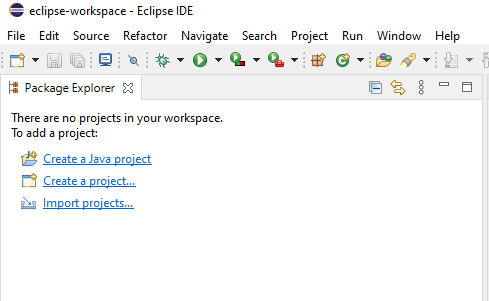
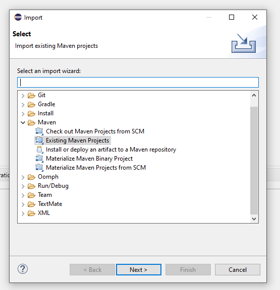
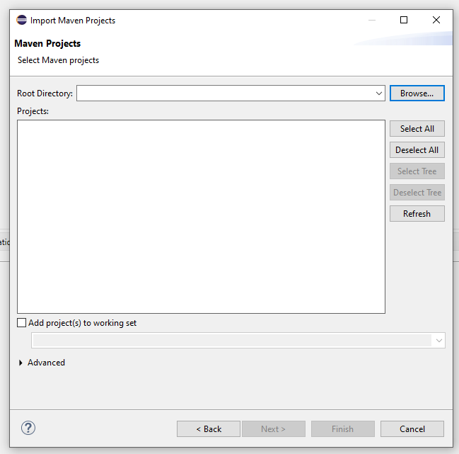
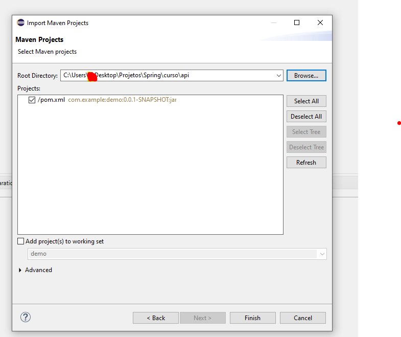

# Api de Spring boot 
### Está api foi contruida seguindo o curso da alura sobre spring boot, esta com o banco de dados h2, spring security, swagger

# Instalação via Eclipse

<table>
  <tr>
     <td>Tela de eclipse, clicar em file e depois import</td>
     <td>Importar projeto, procurar o maven e selecionar projeto existente</td>
     <td>Selecionar o projeto baixado</td>
     <td>Tela de concluir</td>
  </tr>
  <tr>
    <td></td>
    <td></td>
    <td></td>
	<td></td>
   
  </tr>
 </table>