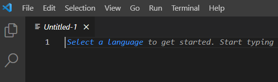
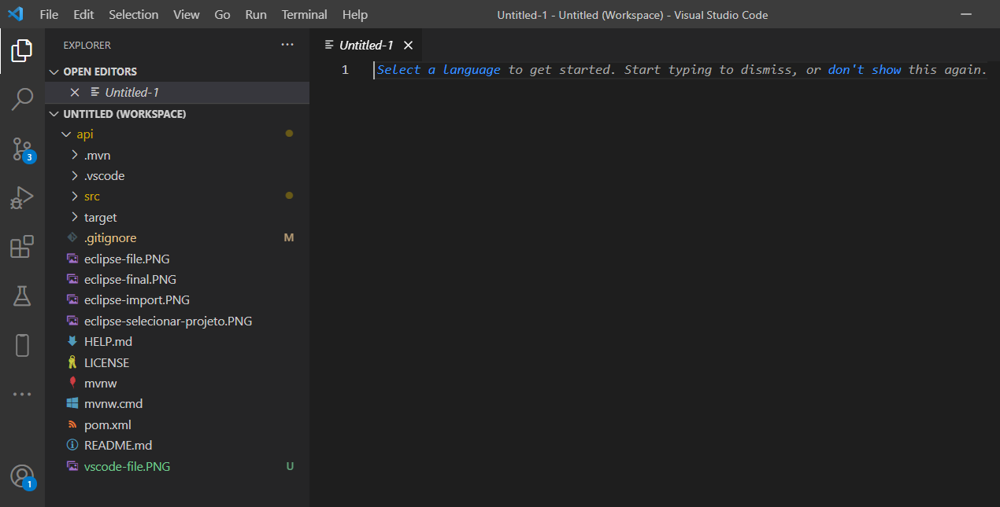

# Api de Spring boot 
### Está api foi contruida seguindo o curso da alura sobre spring boot, esta com o banco de dados h2, spring security, swagger

# Dependencias do projeto
java 8 - <a href="https://www.oracle.com/br/java/technologies/javase-jdk8-downloads.html">Java </a>

Maven - <a href="https://maven.apache.org">Maven </a>

# Instalação via Eclipse

Tela inicial, clicar em file e depois import

 

Importar projeto, procurar o maven e selecionar projeto existente

 

Selecionar o projeto baixado

 

Tela de concluir

 

   

 # Instalação via Visual Code

Tela inicial, clicar em file e depois add folder to Workspace, selecione projeto baixado

 
Depois de adicionar o projeto, pode se baixar o plugin de spring-boot no vscode.
 

